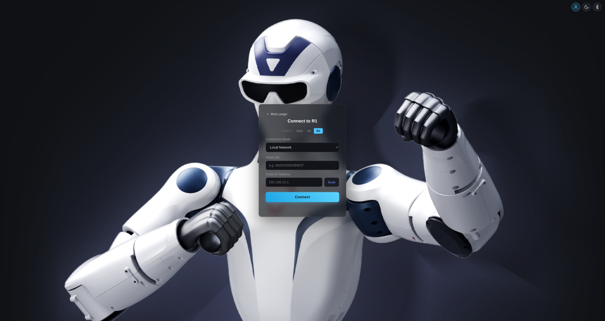

# Unitree WebRTC UI

A browser-based control interface for **Unitree Go2**, **Unitree G1**, and **Unitree R1** robots, communicating over the same WebRTC connection the official mobile apps use. No jailbreak, no firmware modification, no phone app required.

Built with TypeScript, Three.js, and Vite.


<p align="center">
  
</p>

<p align="center">
  
  
  
</p>

## Supported Robots

| Family | Firmware |
|--------|----------|
| **Go2** | 1.0.19 – 1.0.25, 1.1.1 – 1.1.15 *(latest)* |
| **G1**  | 1.2.0 – 1.4.5, 1.5.1+ *(latest)* |
| **R1**  | 1.4.2 *(latest)* |

R1 shares the humanoid control channel with G1, so it inherits the same modes,
arm gestures, status panels and e-stop. Its own FSM state ids differ — Run rides
on 811 (`AmpMotion22Dof`) rather than 801, and it adds the dance / martial-arts
set — all catalogued in [R1 Action List](docs/r1_action_list.md).

## Tour

<p align="center">
  
  
  
</p>

<p align="center">
  
  
  
</p>

## Quick Start

```bash
git clone https://github.com/legion1581/unitree_ui.git
cd unitree_ui
npm install
npm run start          # Vite + Python BLE server together
# or:
npm run start:no-ble   # Vite only, no Bluetooth features
```

`npm run start` and `npm run start:no-ble` already bind Vite to all interfaces, so the terminal will print both a `Local:` (`http://localhost:5173`) and a `Network:` (`http://192.168.x.x:5173`) URL — open the Local one on this machine, the Network one from your phone or another device on the same WiFi. Use **Chrome** (recommended).

If you want Vite by itself (no BLE backend), `npm run dev` is localhost-only; `npm run dev:host` is the LAN-exposed equivalent.

The dev server includes hot module replacement, a built-in UDP multicast scanner (no separate process needed), and proxies for the robot API, Unitree cloud API, and BLE server.

For a production build:

```bash
npm run build && npm run preview
```

### Prerequisites

- Node.js ≥ 18, npm ≥ 9
- Chrome (Firefox is experimental, Safari untested)
- A Unitree Go2, G1, or R1 robot

## Features

- **Real-time 3D viewport** — robot model with live joint angles, lidar spinning animation, voxel point cloud (Go2 SLAM).
- **Camera + dual joystick control** — PIP video, on-screen joysticks, action carousel for sport commands and modes. On R1 the bar mirrors the official app (Damping / Zero Torque / Lock / Run plus the arm gestures) and adds the dance and Kung Fu / Jeet Kune Do states.
- **Audio** — two-way over the WebRTC connection: push-to-talk megaphone broadcast from your mic, click-to-toggle monitoring of the robot's microphone, and an APK-style **Audio Player** in Controls (record clips, upload MP3/WAV — auto-converted to the robot's WAV format, play with single / list / no-loop modes, rename, delete; live play-state sync).
- **Robot status** — battery, motors (temp / position / torque / lost packets), IMU, LiDAR, system info — family-aware fields for Go2 and for the G1 / R1 humanoids.
- **Error handling** — live decoding of firmware fault messages with snapshot + delta reconciliation; NavBar badge with active-count chip, click-anchored popover, transient toast on new faults, and a grouped full-screen list of every active error.
- **Service manager** — list MCF services, start / stop with protection handling.
- **Account manager** — Unitree cloud account: devices, firmware, tutorials, sharing, raw debug API console.
- **3D LiDAR Mapping (SLAM)** — Go2 only: build maps, localize, navigate, patrol, auto-dock and charge; local IndexedDB cache + zip import/export.
- **Bluetooth setup** — pair the robot over BLE (V1/V2 for legacy firmware, V3 for G1 ≥ 1.5.1 / Go2 ≥ 1.1.15) to configure WiFi without the phone app.
- **BLE remote relay** — pair a Unitree BLE remote, forward joystick + buttons to the robot over WebRTC.
- **Dark / light theme** — floating toggle, persisted per-browser; the 3D scene adapts on the fly.
- **Connection modes** — Local Network (STA-L), Access Point (AP), Remote (TURN through Unitree cloud).
- **Network scanner** — UDP multicast auto-discovery, including SN-targeted scan for V3-capable firmware (G1 ≥ 1.5.1, Go2 ≥ 1.1.15).

## Documentation

| Topic | What's covered |
|-------|---------------|
| [Connection](docs/connection.md) | Family selection, STA-L / AP / Remote modes, network scan, AES-128 key flow for V3-capable firmware (G1 ≥ 1.5.1, Go2 ≥ 1.1.15) |
| [Control View](docs/control.md) | Joysticks, action bar, modes, sport command IDs, BLE remote relay |
| [R1 Action List](docs/r1_action_list.md) | R1 FSM state table (fsm_id), SetFsmId api, dances / Kung Fu / Jeet Kune Do |
| [Robot Status](docs/status.md) | Battery / motor / IMU / system panels for every family |
| [Error Handling](docs/error-handling.md) | Fault wire protocol, Go2 + G1 source/code catalog, badge / popover / page UI |
| [Service Manager](docs/services.md) | MCF service list, protection flag, start/stop |
| [Account Manager](docs/account.md) | Cloud sign-in, devices, tutorials, debug console |
| [Bluetooth](docs/bluetooth.md) | Robot provisioning + remote pairing overview |
| [Bluetooth V1/V2 protocol](docs/bluetooth-v1-v2.md) | GATT layout for legacy firmware (Go2 < 1.1.15, G1 < 1.5.1) |
| [Bluetooth V3 protocol](docs/bluetooth-v3.md) | Magic-prefix + GCM key exchange (G1 ≥ 1.5.1, Go2 ≥ 1.1.15) |
| [BLE Remote Control](docs/remote-control.md) | Frame layout, axes/buttons mapping, WebRTC relay |
| [SLAM](docs/slam.md) | Mapping → Localization → Navigation flow, patrol, auto-dock |
| [LiDAR](docs/lidar.md) | Point cloud decoding pipeline |

## Project Structure

```
src/
  api/              # Unitree cloud API client (account, devices, firmware, …)
  connection/       # WebRTC, local/remote connectors, network scanner
  crypto/           # AES-ECB, RSA, AES-GCM for auth and SDP exchange
  protocol/         # Data channel handler, topics, sport commands
  ui/
    components/     # Action bar, PIP camera, status/services/account pages, nav bar
    scene/          # Three.js scene, robot model, voxel map
  proxy-plugin.ts   # Vite plugin: robot proxy, scanner, cloud API, BLE API proxy
public/
  icons/            # Action and mode SVG icons
  sprites/          # UI sprites and backgrounds
  models/           # Go2.glb 3D model (the humanoids use the camera view)
server/
  ble_server.py     # FastAPI BLE backend (scan, connect, WiFi config)
  scanner.mjs       # Standalone UDP multicast scanner (optional)
```

## Acknowledgements

Big thanks to the [RoboLegion](https://robolegion.com) community.

## Support

If you like this project, please consider buying me a coffee:

<a href="https://www.buymeacoffee.com/legion1581" target="_blank"></a>

## License

MIT
